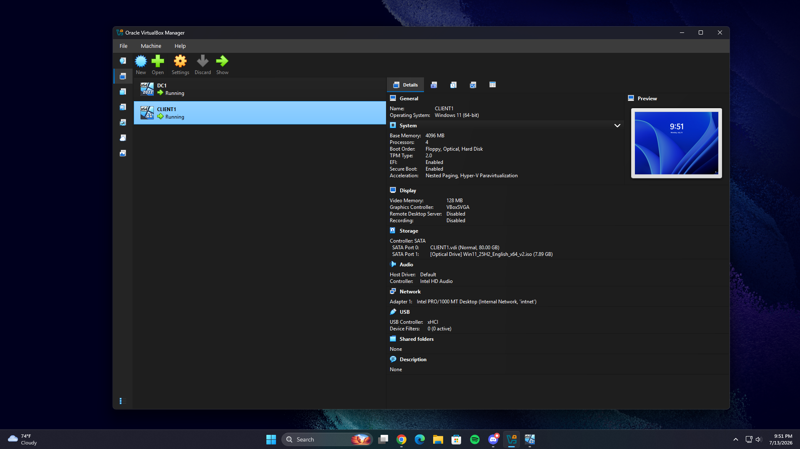
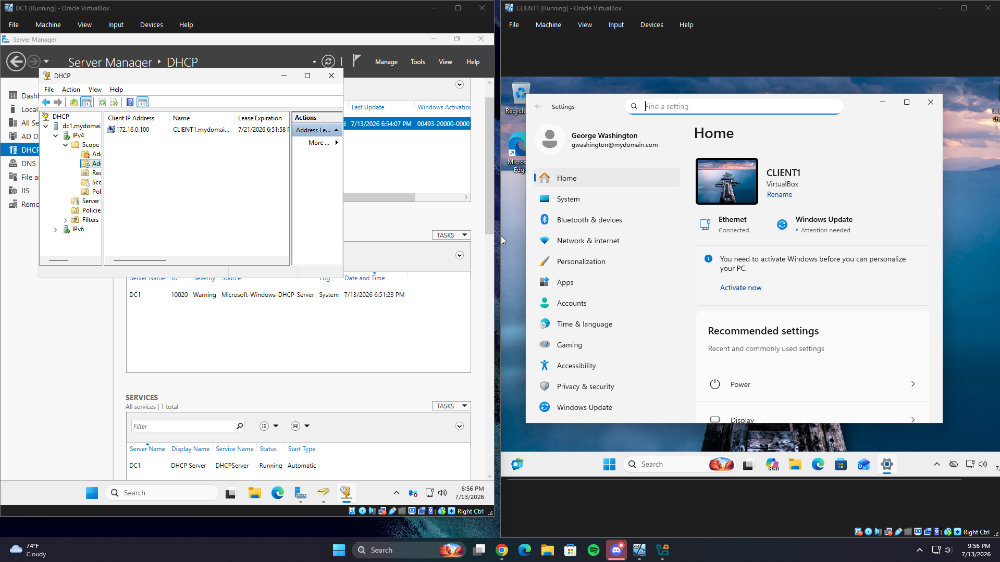

# AD-Domain-Services-Project
Enterprise Active Directory Lab: AD DS deployment, DNS/DHCP infrastructure, RRAS routing, and PowerShell automation for identity management.
# Active Directory Lab Environment

## Project Overview
This project involved the design, deployment, and management of a virtualized enterprise-grade Active Directory (AD) environment. The objective was to simulate a production-ready network to practice identity management, network services, and administrative automation.

## Environment Architecture
- **Hypervisor:** Oracle VirtualBox
- **Infrastructure:**
  - **Domain Controller (DC01):** Windows Server 2025
  - **Client Workstation (CL01):** Windows 11 Pro
- **Key Services:** AD DS, DNS, DHCP, NAT/RRAS

## Technical Achievements
- **Deployment:** Successfully architected an isolated network environment, overcoming hardware compatibility constraints by pivoting from ARM64 to x64 host architecture.
- **Automation:** Developed and executed PowerShell scripts for bulk user provisioning (1,000+ objects), simulating corporate onboarding workflows.
- **Infrastructure:** Configured DHCP scopes and NAT/RRAS routing to provide secure internet access to internal workstations.
- **Security:** Implemented role-based access control (RBAC) and organized users into specific OUs for simplified management.

## Troubleshooting Log
| Date | Issue | Root Cause | Resolution |
| :--- | :--- | :--- | :--- |
| 2026-07-11 | Hardware Incompatibility | Apple Silicon (ARM) vs x64 | Re-platformed to dedicated x64 server |

## Visual Proof of Concept

### Active Directory Dashboard
This screenshot shows the Domain Controller health and the successfully installed AD DS/DNS roles.

### Bulk User Provisioning
Verification of the organizational units and user objects created via PowerShell automation.

## Lessons Learned
- Gained hands-on experience in cross-platform architecture and hypervisor-level optimization.
- Mastered the interaction between core network services (DNS/DHCP) and identity management.
- Developed the ability to troubleshoot enterprise-level service failures.

---
*Created by [Your Name]*
